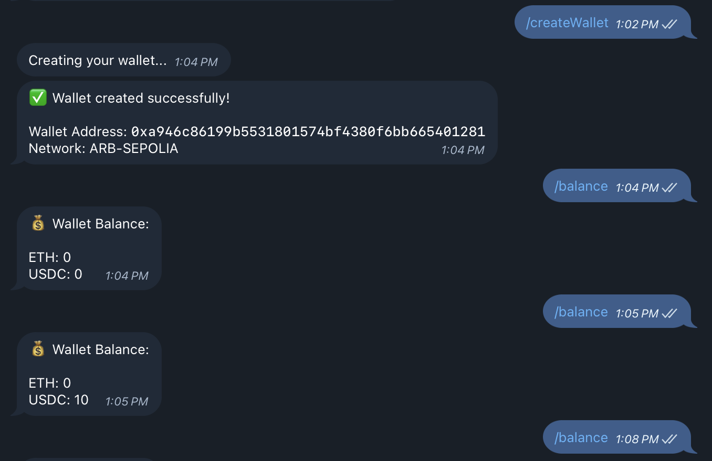

# Telegram Circle Wallet Bot

A powerful Telegram bot that enables developers to create and manage SCA (Smart Contract Account) wallets using Circle's SDK. This bot simplifies interactions across various networks, allowing users to perform operations such as creating wallets, sending USDC, and checking balances swiftly.



## Features

- **Create SCA Wallets**: Seamlessly create SCA wallets on multiple blockchains.
- **View Wallet Address and ID**: Easily retrieve your wallet address and unique wallet ID.
- **Check USDC Balance**: Monitor your wallet balance specifically for USDC.
- **Send USDC**: Execute transactions to send USDC to any address.
- **Secure Credential Storage**: Protect sensitive credentials using secure storage practices.

## Bot Commands
- `/start` - Initialize the bot and get welcome message
- `/createWallet` - Create a new wallet
- `/address` - Get your wallet address
- `/walletId` - Get your wallet ID
- `/balance` - Check your wallet's USDC balance
- `/send <address> <amount>` - Send USDC to another address
  - Example: `/send 0x742d35Cc6634C0532925a3b844Bc454e4438f44e 10`
  - The amount is in USDC
  - Transaction fees are automatically set to LOW level
  - Make sure you have sufficient USDC and native tokens for gas

## Documentation & Resources

- [Circle W3S Node.js SDK Documentation](https://developers.circle.com/w3s/nodejs-sdk)
- [Circle API Reference](https://developers.circle.com/api-reference)
- [Replit.com](https://replit.com/t/circle-developer/repls/telegram-bot-circle-programmable-wallet/)

## Prerequisites

- Node.js v16 or higher
- Circle API Key and Entity Secret (Get started at [Circle Developer Console](https://console.circle.com))
- Telegram Bot Token (obtain from [@BotFather](https://t.me/BotFather))

## Installation

1. Clone the repository:

```bash
git clone https://github.com/eltontay/telegram-bot-circle-programmable-wallet.git
cd telegram-bot-circle-programmable-wallet
```

2. Install dependencies:

```bash
npm install
```

3. Add your secrets to Replit's Secret Manager or set them as environment variables:

```bash
cp .env.sample .env
```

4. Configure your environment variables in the .env file:
- CIRCLE_API_KEY=your_circle_api_key_here
- CIRCLE_ENTITY_SECRET=your_circle_entity_secret_here
- TELEGRAM_BOT_TOKEN=your_telegram_bot_token_here

5. Run server

```bash
npm run dev
```

## Supported Networks 

### Mainnet Networks
- Arbitrum (ARB)
- Polygon (POL)
- Avalanche (AVAX)
- Solana (SOL)
- Ethereum (ETH)

### Testnet Networks
- Arbitrum Sepolia (ARB-SEPOLIA)
- Polygon Amoy (MATIC-AMOY)
- Avalanche Fuji (AVAX-FUJI)
- Solana Devnet (SOL-DEVNET)
- Ethereum Sepolia (ETH-SEPOLIA)

## Network Configurations

The bot supports multiple networks with their respective USDC contract addresses and token IDs. All network configurations are stored in `data/networks.json`.

### Structure
```json
{
  "NETWORK_NAME": {
    "name": "NETWORK_NAME",
    "usdcAddress": "USDC_CONTRACT_ADDRESS",
    "usdcTokenId": "CIRCLE_USDC_TOKEN_ID",
    "isTestnet": boolean
  }
}
```

### Each network entry contains:
- USDC smart contract address
- Circle's USDC token ID
- Network type (mainnet/testnet)

You can configure your preferred network in the .env file:

```bash
NETWORK=ARB-SEPOLIA  # Default network
USDC_TOKEN_ADDRESS=0x75faf114eafb1bdbe2f0316df893fd58ce46aa4d
USDC_TOKEN_ID=4b8daacc-5f47-5909-a3ba-30d171ebad98
```

## Getting Testnet Tokens
To obtain testnet USDC for testing:

- Visit the [Circle Faucet](https://faucet.circle.com/)
- Connect your wallet
- Select the desired testnet network
- Request testnet USDC

## For native tokens (ETH, POL, etc.), use the respective network faucets:

- [Arbitrum Sepolia Faucet](https://www.alchemy.com/faucets/arbitrum-sepolia)
- [Polygon Amoy Faucet](https://faucet.polygon.technology/)
- [Avalanche Fuji Faucet](https://faucet.avax.network/)
- [Solana Devnet Faucet](https://faucet.solana.com/)
- [Ethereum Sepolia Faucet](https://sepoliafaucet.com/)

### Community

Join the Circle Developer Community:
- [Discord](https://discord.gg/buildoncircle)
- [X](https://x.com/BuildOnCircle)
